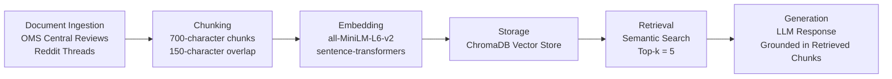

# Project 1 Planning: The Unofficial Guide

> Write this document before you write any pipeline code.
> Your spec and architecture diagram are what you'll use to direct AI tools (Claude, Copilot, etc.) to generate your implementation — the more specific they are, the more useful the generated code will be.
> Update the Retrieval Approach and Chunking Strategy sections if you change your approach during implementation.
> Update this file before starting any stretch features.

---

## Domain

<!-- What domain did you choose? Why is this knowledge valuable and hard to find through official channels? -->
This system covers AI specialization courses' reviews offered by Georgia Tech in their OMSCS program. 
This knowledge is valuable because it helps students make decision on which classes they'll take according to their needs. There is an existing official review website but the reviews are outdated.
---

## Documents

<!-- List your specific sources: URLs, subreddit names, forum threads, or file descriptions.
     Aim for at least 10 sources that together cover different subtopics or perspectives within your domain. -->

| # | Source | Type | URL or file path |
|---|--------|------|-----------------|
| 1 | OMS Central | Review site | https://www.omscentral.com/reviews/recent|
| 2 | Reddit | Review thread |https://www.reddit.com/r/OMSCS/comments/1mf7kay/ai_has_now_been_added_as_a_specialization/ |
| 3 |Reddit |Review thread |https://www.reddit.com/r/OMSCS/comments/kawd2g/order_of_courses_for_ai/ |
| 4 | Reddit|Review thread |https://www.reddit.com/r/OMSCS/comments/1p4reqd/computer_suggestions_for_ai_specialization/ |
| 5 | Reddit| Review thread| https://www.reddit.com/r/OMSCS/comments/14fm1ss/what_is_the_musttaken_ai_course/|
| 6 |Reddit | Review thread| https://www.reddit.com/r/OMSCS/comments/1r8dcqp/how_are_we_feeling_about_ml4t_especially_for/|
| 7 | Reddit| Review thread| https://www.reddit.com/r/OMSCS/comments/qropq7/best_class_to_get_a_sense_of_what_aiml_is_all/|
| 8 |Reddit |Review thread |https://www.reddit.com/r/OMSCS/comments/r6i9l4/what_classes_outside_your_specialization_are_you/ |
| 9 |Reddit |Review thread | https://www.reddit.com/r/OMSCS/comments/18pg1ps/all_courses_ranked_by_difficulty_using_grades_and/|
| 10 | Reddit|Review thread | https://www.reddit.com/r/OMSCS/comments/zojljb/best_first_class_to_take/|
| 11 |Reddit |Review thread |https://www.reddit.com/r/OMSCS/comments/1ldmwpn/feeling_imposter_syndrome_struggling_in_a/ |
| 12 |Reddit |Review thread |https://www.reddit.com/r/OMSCS/comments/1o6k1co/this_class_is_breaking_mesuggestions/ |
| 13 | Reddit| Review thread|https://www.reddit.com/r/OMSCS/comments/1pgo5fs/i_got_out_finished_the_program_after_about_3_years/ |
| 14 |Reddit | Review thread| https://www.reddit.com/r/OMSCS/comments/1lei7sc/is_taking_omscs_nlp_worth_it_if_i_already_took/|

---

## Chunking Strategy

<!-- How will you split documents into chunks?
     State your chunk size (in tokens or characters), overlap size, and explain why those
     numbers fit the structure of your documents.
     A review-heavy corpus warrants different chunking than a long FAQ. -->
The data (OMS Central reviews and Reddit posts/comments) is mostly short and opinion-based text. These docs aren't like long textbooks where a single section may need thousands of tokens. Most useful facts are contained in one review/ one Reddit post/one comment. Because of this, I will chunk by paragraph/comment when possible, then use a fixed character limit for long comments.

**Chunk size:**
I'll use about 700 characters per chunk. This is large enough to preserve the context of a student opinios like "this course is hard because the projects are time-consuming" but still being small enough for retrieval to be able to find focused opinions and not large mixed-topic essays.

For Reddit threads, each post/comment will be treated as a natural unit first. If a comment is more than 700 chars, it'll' be split into multiple chunks. For OMS Central reviews, each review will remain a single chunk if it is short; longer reviews will be split.
**Overlap:**
I'll use an overlap of 150 characters between adjacent chunks.
**Reasoning:**
My corpus has mostly short reviews and discussion comments. A 700-char chunk is big enough to capture a complete opinion, recommendation, or explanation without mixing too many unrelated topics together.

The 150-char overlap helps preserve context when important information falls close to a chunk boundary. For example, a student might explain their background in one part of a comment and provide course recommendations in the next. The overlap increases the chance that both pieces of information will be available during retrieval.

If chunks were smaller, retrieval might give back incomplete statements without context. If chunks are larger, retrieval could return irrelevant information because a single chunk would contain multiple topics/ course discussions.

---

## Retrieval Approach

<!-- Which embedding model are you using (e.g., all-MiniLM-L6-v2 via sentence-transformers)?
     How many chunks will you retrieve per query (top-k)?
     If you were deploying this for real users and cost wasn't a constraint, what tradeoffs
     would you weigh in choosing a different embedding model — context length, multilingual
     support, accuracy on domain-specific text, latency? -->

**Embedding model:**
I'll use all-MiniLM-L6-v2 from the sentence-transformers library. It should perform well for semantic similarity tasks on English texts like my course reviews and Reddit discussions.

**Top-k:**
I'll retrieve the top 5 most relevant chunks for each query. This should give enough context from different student perspectives without overwhelming the LLM with too much unrelated information.

**Production tradeoff reflection:**
If this were deployed for real users and cost was not a constraint, I'd evaluate larger embedding models that provide better semantic understanding and retrieval accuracy. I'd' consider tradeoffs like retrieval quality, inference latency, storage requirements, and support for longer contexts. Since my documents are all English reviews and discussion posts, multilingual support is less important than accuracy on informal student written text.
---

## Evaluation Plan

<!-- List your 5 test questions with their expected correct answers.
     Questions should be specific enough that you can judge whether the system's response
     is right or wrong. "What are good dining halls?" is too vague.
     "What do students say about wait times at [dining hall name] during lunch?" is testable. -->

| # | Question | Expected answer |
|---|----------|-----------------|
| 1 | What courses do OMSCS students commonly recommend as a first course for students interested in AI?| The answer should mention beginner-friendly courses discussed in the "Best first class to take" thread and summarize the reasoning students provide.|
| 2 |What do students say about ML4T for someone pursuing the AI specialization? |The answer should summarize opinions from the ML4T discussion thread, difficulty of class, how useful it is, relevance to AI/ML topics. |
| 3 |What course order do students recommend for completing the AI specialization? |The answer should summarize sequencing advice from the "Order of courses for AI" thread and explain the reasoning behind the suggested order. |
| 4 |Which OMSCS courses are frequently described as the most difficult? |The answer should reference the difficulty ranking thread and identify courses students find challenging or time-consuming. |
| 5 |Is the OMSCS NLP course worth taking if a student has already taken an NLP course before? |The answer should summarize arguments from the NLP discussion thread and when students think the course is or isn't worthwhile. |

---

## Anticipated Challenges

<!-- What could go wrong? Name at least two specific risks with reasoning.
     Consider: noisy or inconsistent documents, missing source attribution, off-topic
     retrieval, chunks that split key information across boundaries. -->

1. Conflicting opinions across sources because different students can have different experiences with the same course depending on their background, semester, prior knowledge. The system has to present these as opinions onstead of objective facts.
2. Reddit threads sometimes branch into unrelated topics. The retrieval system can return chunks that mention OMSCS but don't directly answer the user's question about AI specialization courses.
3. Important details can span multiple comments or paragraphs. Even with overlap, some context could be lost if information is split across chunks.
---

## Architecture

<!-- Draw a diagram of your pipeline showing the five stages:
     Document Ingestion → Chunking → Embedding + Vector Store → Retrieval → Generation
     Label each stage with the tool or library you're using.
     You can use ASCII art, a Mermaid diagram, or embed a sketch as an image.
     You'll use this diagram as context when prompting AI tools to implement each stage. -->

---

## AI Tool Plan

<!-- For each part of the pipeline below, describe:
     - Which AI tool you plan to use (Claude, Copilot, ChatGPT, etc.)
     - What you'll give it as input (which sections of this planning.md, which requirements)
     - What you expect it to produce
     - How you'll verify the output matches your spec

     "I'll use AI to help me code" is not a plan.
     "I'll give Claude my Chunking Strategy section and ask it to implement chunk_text()
     with my specified chunk size and overlap" is a plan. -->
I'll be using ChatGPT as my assistant.

**Chunking**
Input: My Chunking Strategy section above.
Expected Help: Explain if my chosen chunk size and overlap are reasonable for Reddit posts and course reviews.
Verification: Compare the recommendations with retrieval results from my implementation.

**Embedding & Vector Store**
Input: My Retrieval Approach section.
Expected Help: Explain how sentence-transformer embeddings and ChromaDB work together in a RAG pipeline and help troubleshoot setup issues.
Verification: Confirm that the embeddings are generated and stored correctly.

**Retrieval**
Input: Retrieval results from test queries.
Expected Help: Help analyze whether retrieved chunks are relevant and suggest adjustments to top-k if needed.
Verification: Manually inspect retrieval quality on evaluation questions.

**Generation**
Input: Example user questions and retrieved chunks.
Expected Help: Suggest prompt design strategies for generating answers grounded in retrieved sources.
Verification: Check if generated answers are consistent with the retrieved evidence.

**Milestone 3 — Ingestion and chunking:**

**Milestone 4 — Embedding and retrieval:**

**Milestone 5 — Generation and interface:**
